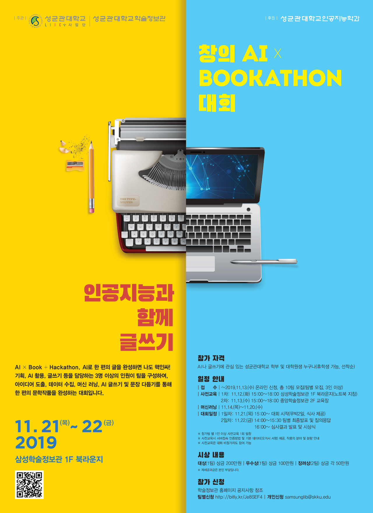

# [AI x Bookathon: 인공지능과 함께 글쓰기]
#### 팀 ELC39 ([정민정](https://github.com/jeina7), [김형준](https://github.com/khj68), [김승태](https://github.com/kim-seungtae))

성균관대학교와 마인즈랩이 협약을 맺고 주최한 [AI x Bookathon]에서 사용한 소스코드 레포입니다.   
대회의 내용은 지난 2월 OpenAI에서 발표한 GPT-2 모델을 학습시켜 하나의 수필 작품을 완성해내는 프로젝트로, 더 자세한 내용은 [블로그](https://jeinalog.tistory.com/entry/AI-x-Bookathon-%EC%9D%B8%EA%B3%B5%EC%A7%80%EB%8A%A5%EC%9D%84-%EC%88%98%ED%95%84-%EC%9E%91%EA%B0%80%EB%A1%9C-%ED%95%99%EC%8A%B5%EC%8B%9C%EC%BC%9C%EB%B3%B4%EC%9E%90)에서, 발표자료는 [이 곳](https://www.slideshare.net/MinjungChung1/ai-bookathon-public)에서 확인하실 수 있습니다.

　   

### 모델이 생성한 문장 샘플
- 오늘의 실패가 거울에 비치고 매번 똑같은 표정을 짓고 있는 모습에 나는 한없이 작아졌다.
- 허물어지고 보니 세월은 삼천을 지나온 것 같다. 세월은 예나 지금이나 흔적을 보이지 않는다.
- 궁핍할 때는 맛보기만 해도 배부르셨는데 지금은 흔치 않은, 깊은 산 자락에서 단 한 번의 해변도 가지 못하고 쓸쓸히 계셨던 아버지를 그려본다.
- 아버지에 대한 회상은 길게, 몇 초 만에 내 마음 깊은 곳의 이야기가 풀려나며, 마음속에 선명한 기억으로 아로새겨진 것처럼 내 감정도 완고해졌다.
- 실연당한 사랑의 아픔을 노래하던 그 노래가 몇 년 만에 다시 나에게 돌아왔다. 짧은 사유의 표현이라고 짐작하면 안 되지만, 그것도 생각보다는 오랜 기간 나를 짓누르고 있던 외로움이었을까.
- 속박되고 미워만 가는 나의 마음을 달래주었던 것은 사랑의 형형색색의 아름다운 색깔, 그 수많은 꽃들과 함께 이 세상에 여운을 남기며 가없는 사랑을 속삭였던 여인이었다.
- 모두 이 겨울 하늘을 보면서, 모두가 아, 무감각해졌다는 것을 알게 될 것이다. 그것은 마치 이 남은 시리운 과정을 거쳐 꺼져가는 불씨를 보듯이.
- 나는 고독이라는 것에, 그리고 기쁨을, 그리고 안락을 통해 모두 함께함으로써 위안해 주고 싶다. 슬픔도 고통도 행복도 나의 삶이니 어찌 싫어하랴.
- 사실 내가 그 정도의 콧대를 가지고 그다지 흥미와 호기심이 없던 내가 못다한 숙제를 얻은 기분이었다. 그러면서도 백일장이라니! 살짝 어깨가 들썩거려 걸음을 재촉했다.
- 그동안 잘해 왔는가 늘 마음에 걸리셨던 어머니. 나를 낳고 지금껏 살아오는 동안 얼마나 참담했을까. 어머니는 내게 모든 것을 딛고 일어서라고 말씀하셨다. 나는 끝내 눈물을 쏟아야 했다.
- 욕심없는 마음으로 번민의 보배목이 되어 나의 품위를 다듬고, 나의 등불같은 삶을 풍요롭게 가꾸면 되는대로 살아가면 되는 것이겠지.

　   

　   
